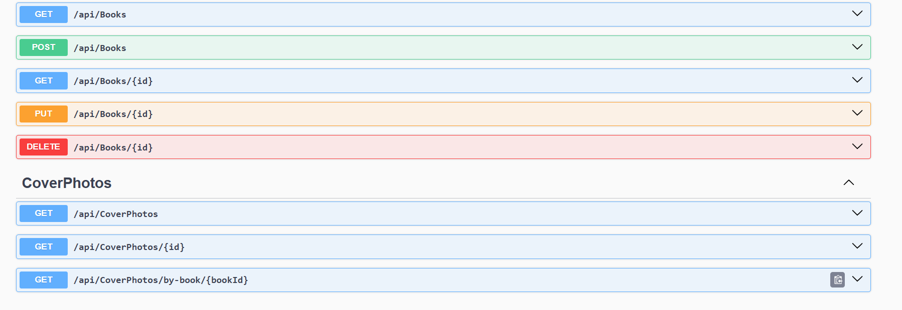
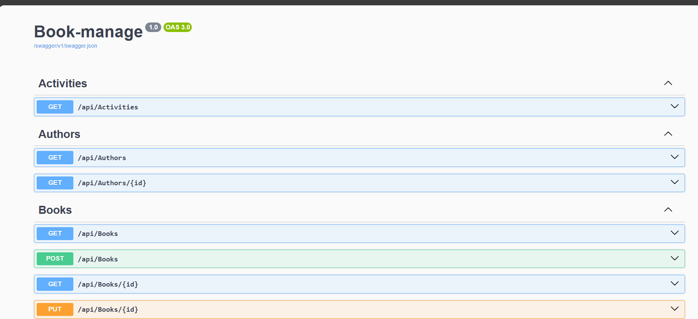
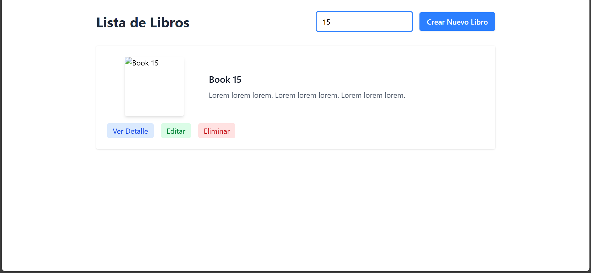
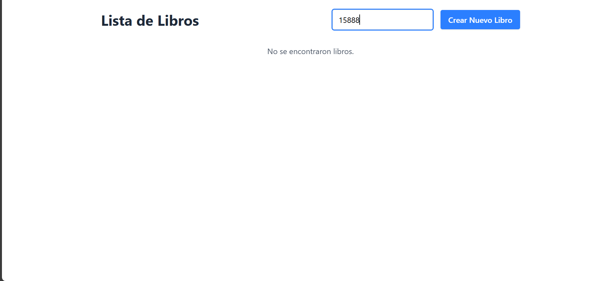
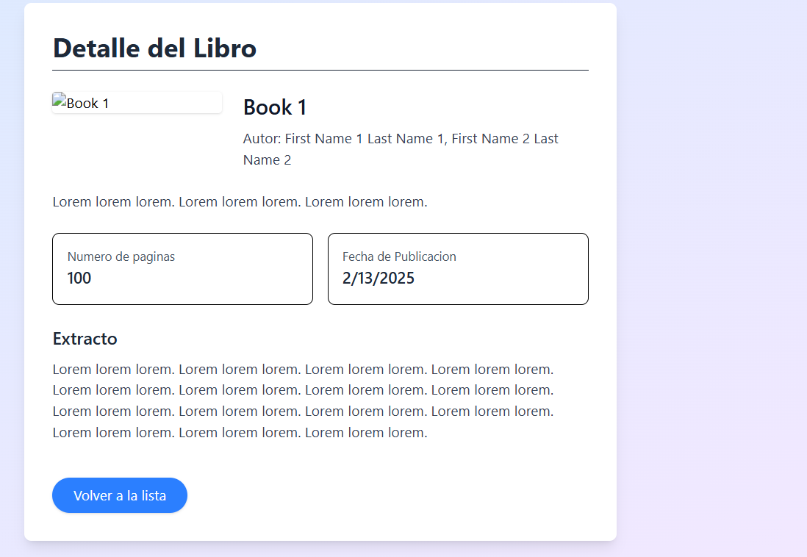
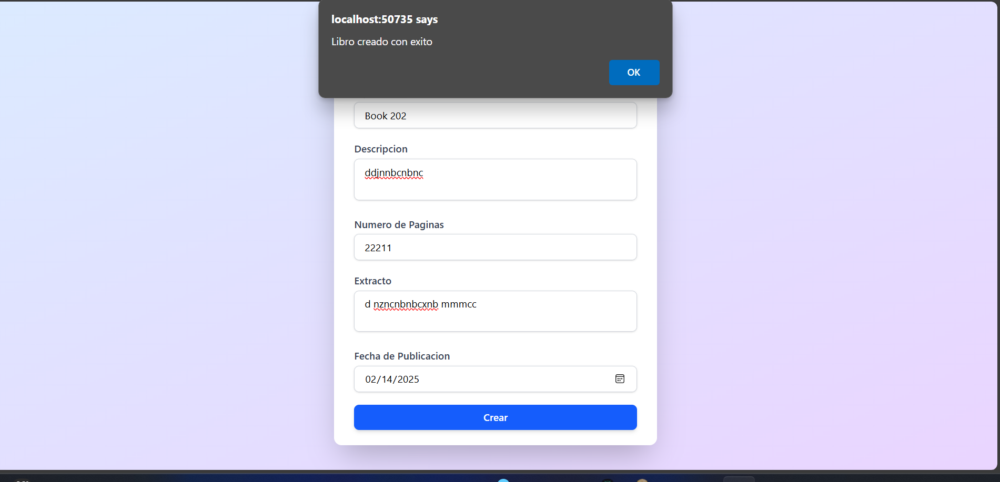

# Book-Manage

Este proyecto es un **sistema de gestión de libros** construido utilizando la **arquitectura Onion** (también conocida como arquitectura limpia). El objetivo principal es **demostrar buenas prácticas de separación de responsabilidades**, mantener una **estructura escalable** y exhibir una **implementación robusta** tanto en el **back-end** como en el **front-end**.

---

## ¿Por qué la Arquitectura Onion?

La arquitectura Onion promueve la **inversión de dependencias** y la **separación de capas** de la siguiente manera:

1. **DomainLayer (Núcleo del dominio)**  
   - Contiene las **entidades** y **modelos** fundamentales (por ejemplo, `Book`, `Author`, `Activity`, `CoverPhoto`, `User`, etc.).  
   - **No depende** de ninguna otra capa; representa el **núcleo** del dominio.

2. **ApplicationLayer**  
   - Alberga la **lógica de aplicación** y los **servicios** que orquestan reglas de negocio o acceso a datos.  
   - Por ejemplo, `ExternalApiService` maneja la comunicación con APIs externas.  
   - Solo depende de **DomainLayer**, aplicando el principio de inversión de dependencias.

3. **InfrastructureLayer**  
   - Se encarga de las **implementaciones concretas** para la persistencia de datos, repositorios y otros servicios de infraestructura.  
   - Por ejemplo, `BookRepository`, `AuthorRepository`, etc.  
   - Implementa las interfaces definidas en ApplicationLayer o DomainLayer.

4. **Book-manage (ASP.NET Core)**  
   - Es el proyecto web que expone los **controladores** (`BooksController`, `AuthorsController`, etc.).  
   - Configura la aplicación (rutas, servicios) y se comunica con las capas internas (ApplicationLayer, InfrastructureLayer) para manejar la lógica y persistencia.

5. **book-cliente (Front-end con React + TypeScript + Tailwind CSS)**  
   - Proporciona la **interfaz de usuario** para que el cliente interactúe con el sistema.  
   - Se comunica con la API expuesta por **Book-manage**.

6. **Library-Test (Pruebas)**  
   - Contiene **pruebas unitarias** ( `ExternalApiServiceTests.cs`) y **pruebas de integración** (`BooksControllerTest.cs`).  
  

---

## ¿Por qué React y Tailwind CSS en el Front-end?

- **React**:  
  - **Velocidad y modularidad**: Permite construir interfaces de usuario de forma declarativa y componentizada, lo que facilita la reutilización de código.  
  - **Gran ecosistema**: Dispone de una amplia comunidad y librerías para casi cualquier necesidad (enrutamiento, manejo de estado, testing, etc.).  
  - **Escalabilidad**: Resulta sencillo mantener aplicaciones de mediano y gran tamaño gracias a su estructura de componentes y a herramientas como React Router o Redux.

- **Tailwind CSS**:  
  - **Rapidez de desarrollo**: Proporciona clases utilitarias que permiten diseñar rápidamente sin necesidad de escribir CSS personalizado en cada vista.  
  - **Consistencia en estilos**: Garantiza un estilo uniforme en toda la aplicación, reduciendo discrepancias en la UI.  
  - **Alto rendimiento**: Genera un CSS optimizado, eliminando clases no utilizadas y minimizando el peso de los archivos en producción.

---

## Tecnologías Principales

- **ASP.NET Core (C#)**  
  - Exposición de endpoints REST a través de controladores.  
  - Integración con inyección de dependencias y middlewares.

- **Entity Framework (Opcional)**  
  - Para la persistencia en base de datos, si se requiere.  
  - Abstracción de acceso a datos con Repositorios en InfrastructureLayer.

- **React + TypeScript**  
  - Creación de componentes tipados, lo que reduce errores y mejora la mantenibilidad.  
  - Interfaz moderna y responsiva, comunicándose con la API vía fetch o axios.

- **Tailwind CSS**  
  - Sistema de utilidades para estilos que agiliza el desarrollo de UI.  
  - Diseño responsivo e interacciones con hover, focus y transiciones personalizadas.

- **xUnit, Moq, RichardSzalay.MockHttp** (para pruebas)  
  - **xUnit**: Framework de testing popular para .NET.  
  - **Moq**: Librería de mocking para aislar dependencias.  
  - **MockHttp**: Simula respuestas HTTP en pruebas unitarias, evitando llamadas reales a servicios externos.

---
## Capturas de Pantalla

### Swagger (Documentación de la API)



### Front-end: Lista de Libros



### Front-end: Busquedas 


### Front-end: Detalle del Libro


### Front-end: fromulario 


---
## Cómo Ejecutar el Proyecto
 **Nota: Si estas Utilizando Visual studio 2022 solo debes de reconstruir la solucion  y verificar que el proyecto de cliente y el de presentacion esten como proyectos de inicio**

1. **Backend (Book-manage)**  
   - Abre la solución en VS Code).  
   - Selecciona **Book-manage** como proyecto de inicio.  
   - Ejecuta (F5 o `dotnet run` en la carpeta del proyecto).  
   - La API estará disponible en `http://localhost:<puerto>` (o `https://` si usas SSL).

2. **Front-end (book-cliente)**  
   - Asegúrate de tener [Node.js](https://nodejs.org) instalado.  
   - En la carpeta `book-cliente`, corre:
     ```bash
     npm install
     npm run dev
     ```
   - Abre tu navegador en la URL que aparezca (por defecto, `http://localhost:5173` o similar).

3. **Pruebas (Library-Test)**  
   - Abre la ventana **Test Explorer** en Visual Studio.  
   - Haz clic en **Run All** para ejecutar todas las pruebas.  
   - O desde la línea de comandos:
     ```bash
     dotnet test
     ```
   - Se validan tanto pruebas unitarias como de integración, asegurando la calidad del proyecto.

---

## Estructura de Carpetas

Book-manage.sln ├─ ApplicationLayer │ ├─ Interfaces │ └─ Services ├─ DomainLayer │ └─ Models ├─ InfrastructureLayer │ └─ Repositories ├─ Book-manage (ASP.NET Core) │ ├─ Controllers │ └─ Program.cs ├─ book-cliente (React + TS + Tailwind) │ ├─ src │ │ ├─ components │ │ ├─ main.tsx │ │ └─ ... │ └─ package.json ├─ Library-Test │ ├─ ExternalApiServiceTests.cs │ └─ BooksControllerTest.cs └─ ...


---


---


---

### Nota Final

Este proyecto se concibió como **prueba técnica** . La  aplicación de **arquitectura Onion**, el uso de **.NET** en el back-end, y la implementación de un **front-end** escalable con **React** y **Tailwind**. Con esta estructura, se pretende mostrar:

- **Orden y separación de capas** en el back-end.  
- **Buenas prácticas** de testing (unitario e integración).  
- **Modularidad y velocidad de desarrollo** en el front-end gracias a React y Tailwind CSS.

¡Gracias su interes y espero algun feedback de parte de ustedes


